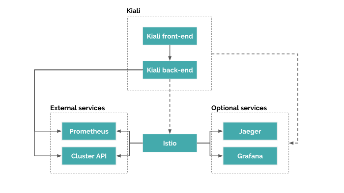

# Installation

In this module, we will install Istio and related tools on Google Kubernetes Engine Cluster.

An architecture looks like:



Including:

* Istio
* Prometheus
* Grafana
* Tracing(Jaeger)
* Kiali

## Requirement

* gcloud
* helm

## Project Setting

```
gcloud config set core/project <your-project-id>
gcloud config set compute/zone asia-east1-b
```

## Provision Kubernetes Cluster

```
gcloud beta container clusters create "gke-cluster" \
  --machine-type "n1-standard-2" \
  --preemptible \
  --enable-stackdriver-kubernetes \
  --enable-ip-alias
```

## Bind Cluster Role ClusterAdmin

```
kubectl create clusterrolebinding cluster-admin-binding \
  --clusterrole cluster-admin \
  --user $(gcloud config get-value account)
```

## Install Istio

Reference: https://istio.io/docs/setup/

### Downlaod istio

```
export ISTIO_VERSION=1.3.0

curl -L https://git.io/getLatestIstio | sh -
cd "istio-${ISTIO_VERSION}"
```

### Create Namespace for Istio

```
kubectl create namespace istio-system
```

### Generate Istio's CRD and deploy to Kubernetes cluster

```
helm template install/kubernetes/helm/istio-init \
  --name istio-init \
  --namespace istio-system \
  | kubectl apply -f -
```

Check `install/kubernetes/helm/istio/values.yaml`, modify value you want. In default, those applications are disable:

* grafana
* tracing(jarger)
* kiali
* certmanager

### Generate Istio's components and deploy to Kubernetes cluster

```
helm template install/kubernetes/helm/istio \
  --name istio \
  --namespace istio-system \
  --values install/kubernetes/helm/istio/values.yaml \
  | kubectl apply -f -
```

## Verify the installation

```
kubectl get svc -n istio-system
kubectl get po -n istio-system
```

The output should look like:
```
NAME                                      READY   STATUS      RESTARTS   AGE
istio-citadel-6d756688d4-snztx            1/1     Running     0          112s
istio-cleanup-secrets-1.2.4-tdpl8         0/1     Completed   0          115s
istio-galley-5bdf7c7fc7-kpmv4             1/1     Running     0          114s
istio-ingressgateway-74864b6d6d-84wff     1/1     Running     0          113s
istio-init-crd-10-nfjgn                   0/1     Completed   0          2m6s
istio-init-crd-11-qsjct                   0/1     Completed   0          2m6s
istio-init-crd-12-8txn6                   0/1     Completed   0          2m6s
istio-pilot-55cb5db998-kf8ls              2/2     Running     0          112s
istio-policy-67b4bbdb7c-dh8nj             2/2     Running     1          113s
istio-security-post-install-1.2.4-l9wdg   0/1     Completed   0          115s
istio-sidecar-injector-6d4647876-cksdj    1/1     Running     0          112s
istio-telemetry-f9466d85f-njkw6           2/2     Running     2          112s
prometheus-dff9f5b67-rbz5p                1/1     Running     0          112s
```

## Access Prometheus

[Prometheus](https://prometheus.io) is a monitoring system & time series database.

Default is enabled.

### Port forward

```
kubectl -n istio-system port-forward \
  $(kubectl -n istio-system get pod -l app=prometheus -o jsonpath='{.items[0].metadata.name}') \
  9090:9090
```

### Check the target status

Access http://localhost:9090

Move to `Status -> Targets` page.

All Targets should be up. If not, it maybe miss some steps like Role.

Reference: https://github.com/istio/old_issues_repo/issues/249

We won't talk about the details of Prometheus here.

## Access Grafana

[Grafana](https://grafana.com/) is a observability platform.

### Enable Grafana

```
helm template install/kubernetes/helm/istio \
  --name istio \
  --namespace istio-system \
  --set grafana.enabled=true \
  | kubectl apply -f -
```

### Port forward

```
kubectl -n istio-system port-forward \
  $(kubectl -n istio-system get pod -l app=grafana -o jsonpath='{.items[0].metadata.name}') \
  3000:3000
```

### Check the dashboard

Access http://localhost:3000

## Access Jaeger

[Jaeger](https://www.jaegertracing.io/) is a distributed tracing tool.

### Enable Jaeger

```
helm template install/kubernetes/helm/istio \
  --name istio \
  --namespace istio-system \
  --set tracing.enabled=true \
  | kubectl apply -f -
```

### Port forward

```
kubectl -n istio-system port-forward \
  $(kubectl -n istio-system get pod -l app=jaeger -o jsonpath='{.items[0].metadata.name}') \
  16686:16686
```

### Check the dashboard

Access http://localhost:16686

## Access Kiali

[Kiali](https://www.kiali.io/) is a service mesh observability and configuration tool.

### Add a Kiali user account

```
kubectl -n istio-system create secret generic kiali \
  --from-literal=username=admin \
  --from-literal=passphrase=#NIMDA$
```

### Enable Kiali

The Kiali version should be specific.

```
helm template install/kubernetes/helm/istio \
  --name istio \
  --namespace istio-system \
  --set kiali.enabled=true \
  --set kiali.tag=v1.4.2 \
  | kubectl apply -f -
```

### Port forward

```
kubectl -n istio-system port-forward \
  $(kubectl -n istio-system get pod -l app=kiali -o jsonpath='{.items[0].metadata.name}') \
  20001:20001
```

### Check the dashboard

Access http://localhost:20001
