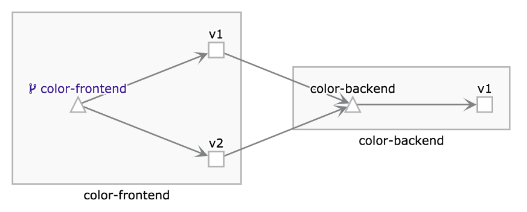
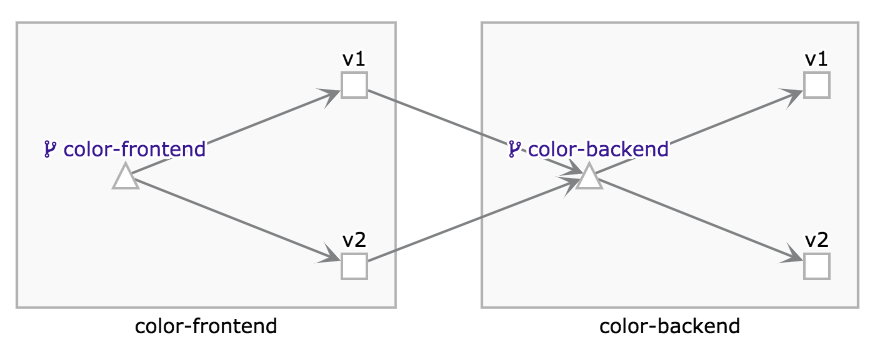

# Traffic Management

Before start this module, you have to finish Module-2.

Move work directory to `cd module-3/`

```
cd module-3/
```

# Route by Query Parameters

## Deploy new version of color-frontend

Modify color-frontend `src/main.go`, We had prepared the modified files.

```

```

to

```

```

Build and push new container image

```
docker build ./color-frontend/ \
  -f ./color-frontend/dockerfile \
  -t "gcr.io/$(gcloud config get-value core/project)/color-frontend:v2"

docker push "gcr.io/$(gcloud config get-value core/project)/color-frontend:v2"
```

Deploy new versions to kubernetes cluster

```
cat ./kubernetes/v2-color-frontend-deployment.yaml \
 | sed "s|<REPLACE_WITH_YOUR_PROJECT_ID>|$(gcloud config get-value core/project)|g" \
 | kubectl apply -f -
```

Check the containers in Pod

```
kubectl get pod
```

It looks like:

```
NAME                                 READY   STATUS    RESTARTS   AGE
NAME                                 READY   STATUS    RESTARTS   AGE
color-backend-v1-566b649bfb-qkphd    2/2     Running   0          36m
color-frontend-v1-849bcbc8dd-sgpjw   2/2     Running   0          36m
color-frontend-v2-db755c8d8-h5h9d    2/2     Running   0          9s
```

Send some traffic to ingress ip, in kiali Graph page, you should see:



## Configure route

There's many pattern to meet your requirement. [HTTPMatchRequest Reference](https://istio.io/docs/reference/config/networking/v1alpha3/virtual-service/#HTTPMatchRequest)

Like:

* uri
* header
* port
* queryParams
* ...

Update Istio config for color-frontend

```
kubectl apply -f ./istio/color-frontend-destination-rule.yaml
kubectl apply -f ./istio/route-with-queryparams
```

Now you can

Access the `http://<The Ingress external IP>` with web browserss.

It looks like:


Access the `http://<The Ingress external IP>/?dev=true` with web browserss.

It looks like:


# Route by SourceLabel

## Deploy new version of color-backend

Modify color-backend `src/main.go`, We had prepared the modified files.

```
func color(w http.ResponseWriter, r *http.Request) {
    fmt.Fprintf(w, "red")
}
```

to

```
func color(w http.ResponseWriter, r *http.Request) {
    fmt.Fprintf(w, "green")
}
```

Build and push new container image

```
docker build ./color-backend/ \
  -f ./color-backend/dockerfile \
  -t "gcr.io/$(gcloud config get-value core/project)/color-backend:v2"

docker push "gcr.io/$(gcloud config get-value core/project)/color-backend:v2"
```

Deploy new versions to kubernetes cluster

```
cat ./kubernetes/v2-color-backend-deployment.yaml \
 | sed "s|<REPLACE_WITH_YOUR_PROJECT_ID>|$(gcloud config get-value core/project)|g" \
 | kubectl apply -f -
```

Check the containers in Pod

```
kubectl get pod
```

Looks like:

```
NAME                                 READY   STATUS    RESTARTS   AGE
color-backend-v1-566b649bfb-86cq5    2/2     Running   0          55m
color-backend-v2-79bdcbff4b-vkqpj    2/2     Running   0          10s
color-frontend-v1-849bcbc8dd-mpl7v   2/2     Running   0          55m
color-frontend-v2-645665fb4b-9stld   2/2     Running   0          53m
```

Send some traffic to ingress ip, in kiali Graph page, you should see:



## Configure route

Update Istio config for color-backend

```
kubectl apply -f ./istio/color-backend-destination-rule.yaml
kubectl apply -f ./istio/route-with-sourcelabels
```

Now you can

Access the `http://<The Ingress external IP>` with web browserss.

It looks like:


Access the `http://<The Ingress external IP>/?dev=true` with web browserss.

It looks like:


