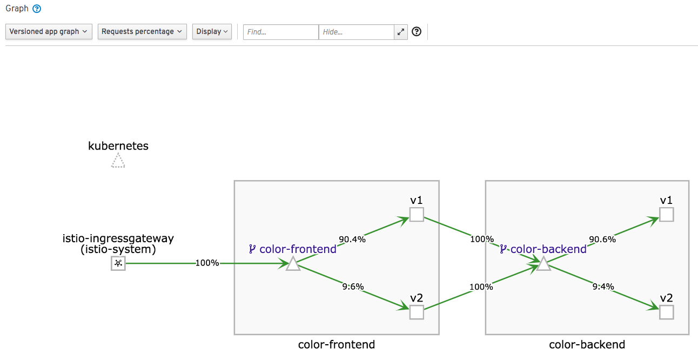

# Canary Deployment

Before start this module, you have to finish Module-3.

Move work directory to `cd module-4/`

```
cd module-4/
```

## Route with weight

Update Istio configuration of color-frontend, we set the percentags:

* v1: 90%
* v2: 10%

```
kubectl apply -f ./istio/color-frontend-virtual-service.yaml
```

Test (v2 is green)

```
INGRESS_IP=<The Ingress external IP>
for i in `seq 100`;do curl -s "http://${INGRESS_IP}" | grep green; done | wc -l
```

You may get `9` or `17` near `10`.

```
INGRESS_IP=<The Ingress external IP>
for i in `seq 1000`;do curl -s "http://${INGRESS_IP}" | grep green; done | wc -l
```

You may get `101` or `110` near `100`. And we can see the requests percentage



This testing prove we can split trrafic by weight. You can try to set weight to 20/80.
